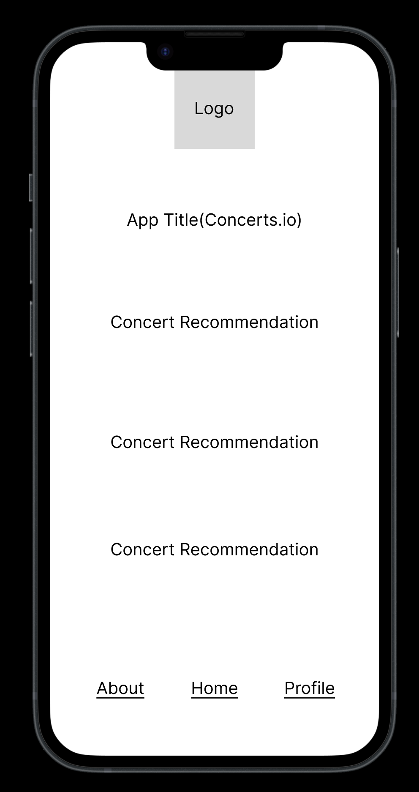
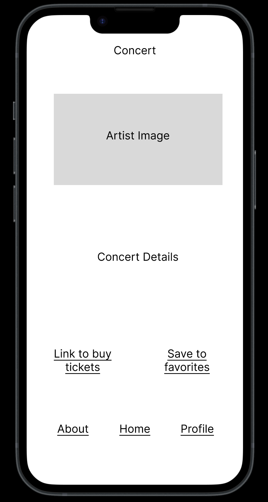
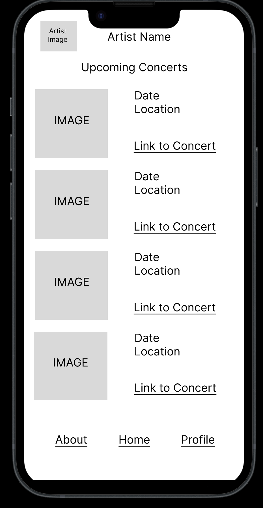
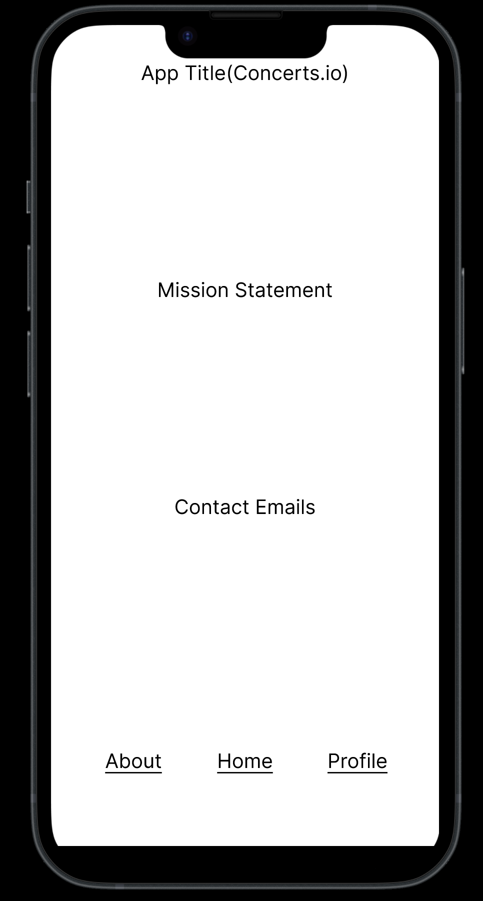
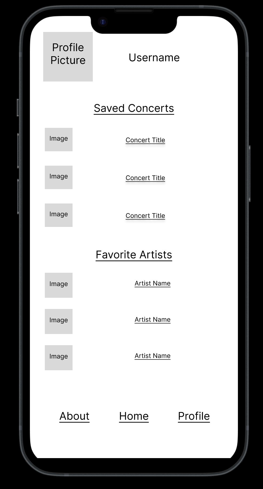
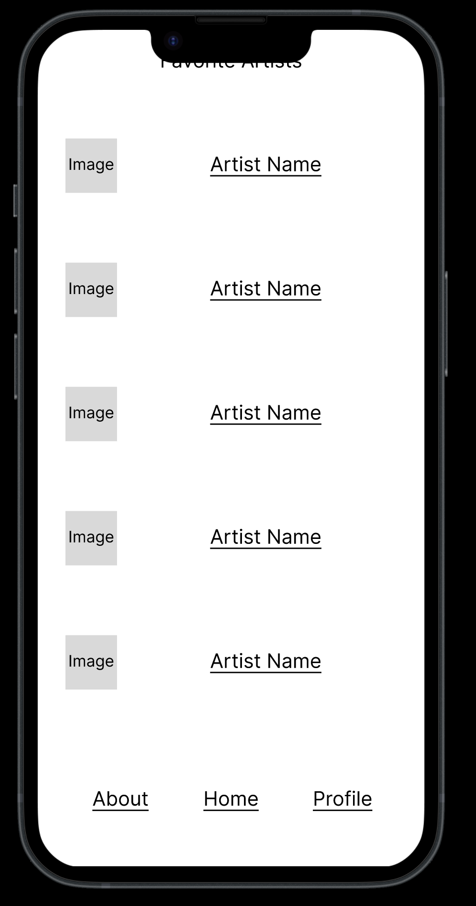
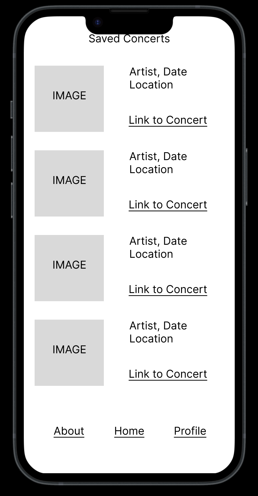

# Concerts.io UX-Design 

 A straight-forward application design that presents concert information first and foremost.

## App Map

## Wireframe

### Home

The homepage of the application, where users can find their concert reccomendations. As is present in all pages, there is a navigation menu on the bottom.

### Concert

A page that represents a concert, which includes details (such as artist and location), and includes a link to buy tickets and an option to add the concert to the users saved concerts list

### Artist

A page that details an artist's upcoming concerts

### About

A page that includes information about the application as well as contact information for users to reach out to the team

### Profile

A users profile page, where they can access their favorite artists and saved concerts

### Favorite Artists

A page where Users can browse their favorite artists and navigate to their pages.

### Saved Concerts

A page where users can browse their collection of saved concerts that they are interested in attending

## Link To Figma Prototype
[Link To Concerts.io prototpye](https://www.figma.com/proto/z4GVSZ1BbBDW4fGIACFuyF/wireframe?node-id=12%3A54&scaling=scale-down&page-id=0%3A1&starting-point-node-id=10%3A9)

